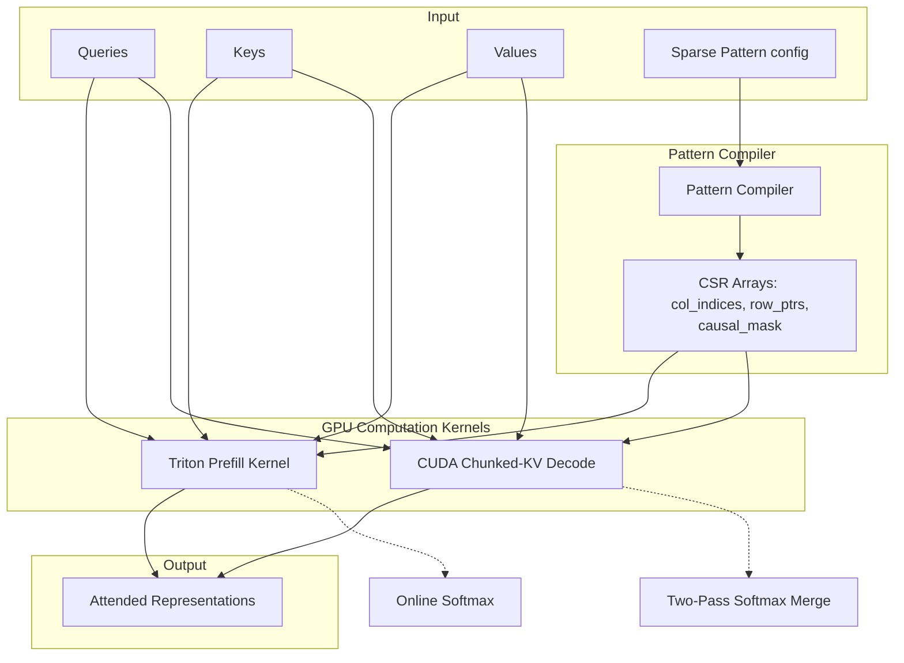

<div align="center">

# Sparse-Attention
### Enterprise-Grade Block-Sparse Attention for Infinite Context LLMs

[](https://python.org)
[](https://pytorch.org)
[](LICENSE)

</div>

## System Overview

Sparse-Attention provides custom CUDA/Triton kernels that replace the standard $O(N^2)$ dense attention mechanism with a structured block-sparse pattern. By combining heterogeneous attention constraints (local sliding windows, global stride landmarks, and prefix context), it enables Large Language Models to scale context lengths up to 1M tokens without memory overflow (OOM) and achieves over an order-of-magnitude reduction in latency.

The system is designed as a drop-in attention backend compatible with vLLM, optimizing both prefill and autoregressive decode operations for production deployments.

## Architecture



## System Capabilities

| Capability | Specification |
|---|---|
| **Memory Optimization** | Achieves 100× reduction in memory usage at 128K context (99% sparsity). Fits 1M context on single-node GPU arrays. |
| **Throughput Acceleration** | Up to 10× speedup over optimized Dense SDPA kernels on modern hardware architectures. |
| **Decode Utilization** | Implements Chunked-KV decode to solve SM underutilization. Increases active blocks from $O(H)$ to $O(H \times \text{Chunks})$, achieving 100% SM occupancy. |
| **Numerical Stability** | Leverages Flash-Attention style online softmax algorithms, ensuring maximum absolute errors remain strictly $<10^{-3}$ vs. dense reference. |
| **Integration** | Exportable PyTorch APIs and direct HuggingFace model patching via a custom vLLM `AttentionBackend`. |

## Technical Implementation Details

### Heterogeneous Block-Sparse Patterns
The core data structure is a block-level binary mask serialized in Compressed Sparse Row (CSR) format. Block $(I, J)$ is evaluated as active if it satisfies any combination of structural constraints:
1. **Diagonal**: $I = J$ (Required for causal self-attention).
2. **Local Window**: $I - w \le J < I$.
3. **Global Stride**: $J \pmod s = 0 \land J \le I$.
4. **Prefix/System**: $J < g$.

### Online Softmax (Prefill)
The Triton prefill kernel processes CSR rows efficiently without branch divergence on empty rows:
$$m_{\text{new}} = \max(m_{\text{old}}, \max(S))$$
$$p = \exp(S - m_{\text{new}})$$
$$l_{\text{new}} = \exp(m_{\text{old}} - m_{\text{new}}) \cdot l_{\text{old}} + \sum p$$
$$O_{\text{new}} = \exp(m_{\text{old}} - m_{\text{new}}) \cdot O_{\text{old}} + p \cdot V$$

### Two-Pass Chunked-KV (Decode)
Standard autoregressive sparse decoding suffers from low Streaming Multiprocessor (SM) utilization ($<30\%$ on A100). The chunked-KV system partitions the active context into fixed-size chunks (e.g., 512 tokens), dispatching grid dimensions of $(B \times H \times \text{ActiveChunks})$. A subsequent reduction kernel merges the partial states via a secondary online softmax aggregation.

## Installation & Deployment

Deploy the kernel package via standard Python package management:

```bash
# Core package
pip install -e .

# With GPU acceleration
pip install -e ".[triton]"

# With production vLLM backend
pip install -e ".[vllm]"
```

*For comprehensive API integration guides and theoretical analyses, refer to the `docs/` directory.*

## License
MIT License.
